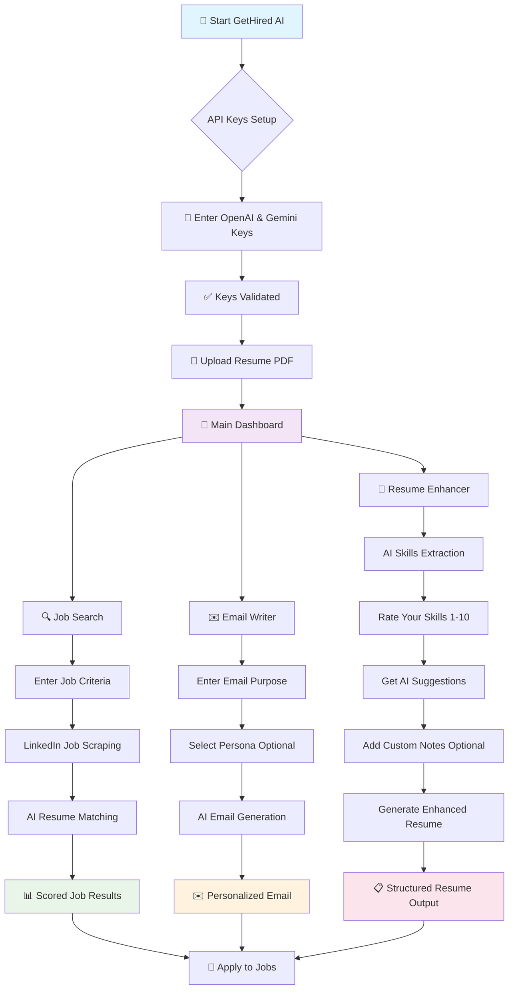

# GetHired AI-MVP 🎯

A comprehensive MVP of AI-powered job help assistant that transforms your job hunting experience through intelligent automation, personalized email generation, and AI-driven resume enhancement.


## 🌟 Overview

GetHired AI is a job hunting helper that combines the power of LLMs with practical job hunting tools. It provides an integrated platform for finding jobs via LinkedIn requests, generating personalized application emails, and enhancing your resume - all powered by LLM Integration in each step.

> **Note**: This is an MVP (Minimum Viable Product) currently in development phase, built for learning and experimentation with AI technologies in job search automation. Features are actively being improved.

## 🚀 Core Features

- **🔍 Intelligent Job Search**: LinkedIn job scraping with AI-powered resume matching scores, time-based filtering for latest job postings, and customizable matching threshold filtering between your profile and job requirements
- **✉️ Personalized Email Generation**: AI-crafted job application emails with context awareness
- **📝 Resume Enhancement**: AI-driven analysis with actionable improvement suggestions
- **🎯 Unified Experience**: Single resume upload shared across all features


## 📊 GetHired AI Workflow



## 🏗️ Project Structure (GetHire MVP)

The main application is organized in the `gethire-mvp/` directory:

```
gethire-mvp/
├── app/
│   ├── main_app.py           # 🎯 Main Streamlit application & landing page
│   ├── jobsearch_app.py      # 🔍 Job search functionality with LinkedIn scraping
│   ├── email_writer_app.py   # ✉️ AI email generation with persona customization
│   └── resume_enhance_app.py # 📝 Resume analysis and enhancement suggestions
├── backend/
│   ├── linkedinsearch.py     # 🔗 LinkedIn job scraping engine
│   ├── pinecone_init.ipynb   # 📊 Vector database initialization (development)
│   └── resume_writer_dev.ipynb # 🛠️ Resume writing experimentation (development)
└── utils/
    ├── doc_extract.py        # 📄 PDF and document text extraction
    └── model_validation.py   # ✅ API key validation for OpenAI & Gemini
```

### Core Components

- **Main Application**: Unified interface with session state management
- **Job Search Engine**: LinkedIn integration with AI-powered matching
- **Email Generator**: Context-aware email composition with persona targeting
- **Resume Enhancer**: Structured analysis with skill rating and suggestions

## 🚀 Quick Start

### Prerequisites
- Python 3.11+
- OpenAI API Key (GPT-4 access recommended)
- Google Gemini API Key
- Requests library
- 

### Installation

1. **Clone the repository**
   ```bash
   git clone <repository-url>
   cd get-hire-ai
   ```

2. **Install dependencies**
   ```bash
   pip install -r requirements.txt
   ```

3. **Launch the application**
   ```bash
   streamlit run gethire-mvp/app/main_app.py
   ```

## 📋 Usage Guide

### 1. Initial Setup
- **API Configuration**: Enter your OpenAI and Gemini API keys on the landing page
- **Key Validation**: System automatically validates API access and model availability
- **Resume Upload**: Upload your PDF resume (shared across all features)

### 2. Job Search Workflow
- **Search Criteria**: Enter job titles, locations, experience level, and filters
- **Time Controls**: Filter jobs by posting time (1hr, 24hr, past week, last 30 days) for fresh opportunities
- **LinkedIn Scraping**: Automated job discovery from LinkedIn job postings
- **AI Matching**: Resume-job compatibility scoring using Gemini AI with customizable threshold filtering
- **Results Display**: Scored job listings with match percentages, posting times, and detailed job information

### 3. Email Generation Workflow
- **Purpose Definition**: Describe the email intent (e.g., "asking for referral")
- **Persona Targeting**: Specify recipient type (e.g., "hiring manager", "data scientist")
- **AI Composition**: GPT-4 generates personalized, professional emails
- **Context Integration**: Automatically incorporates resume information

### 4. Resume Enhancement Workflow
- **Skill Extraction**: AI identifies top 5 technical and professional skills
- **Interactive Rating**: Rate your proficiency level (1-10) for each skill
- **AI Suggestions**: Receive specific, actionable improvement recommendations
- **Custom Input**: Add personal notes and feedback for tailored enhancements
- **Structured Output**: Generate enhanced resume in organized format

## 🛠️ Technology Stack

### AI Models
- **OpenAI GPT-4(GitHub Models-endpoint)**: Email generation and text processing
- **Google Gemini**: Job matching and resume analysis


### Core Technologies
- **Streamlit**: Interactive web interface
- **PyPDF2**: PDF document processing
- **Pydantic**: Data validation and structured outputs
- **Session State Management**: Cross-feature data persistence
- **LinkedIn Integration**: Realtime-Job data scraping and extraction via requests


## ⚙️ Configuration

### Environment Variables
Create a `.env` file in the root directory:
```env
OPENAI_API_KEY=your_openai_api_key_here
GEMINI_API_KEY=your_gemini_api_key_here
```

### Streamlit Secrets (for deployment)
Create `.streamlit/secrets.toml`:
```toml
OPENAI_API_KEY = "your_openai_api_key_here"
GEMINI_API_KEY = "your_gemini_api_key_here"
```


## 📖 Additional Resources

The project also includes supplementary RAG (Retrieval-Augmented Generation) components for advanced email generation:

- **`email-writer-rag/`**: Standalone email apps with vector database integration
- **`resume-writer/`**: Independent resume analysis and writing tools

For detailed information about these components, refer to their respective README files.

## 🚀 Future Enhancements

- Integration with job application APIs
- Advanced LinkedIn scraping with dynamic content loading
- Multi-platform use for wide job postings in realtime
- Integration with Email client(gmail...)
- Resume template generation with LaTeX export as pdf ready file


